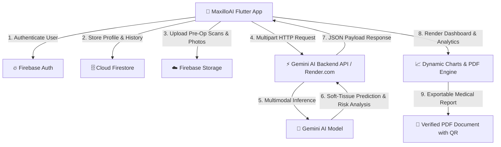

# 🏥 MaxilloAI

### *AI-Powered Maxillofacial Surgery & Soft-Tissue Outcome Predictor*

**Transforming pre-operative surgical planning into precision post-surgical reality through Multimodal Gemini AI.**

---


---

## 📌 Table of Contents

- [Motivation & Problem Statement](#-motivation--problem-statement)
- [Key Features](#-key-features)
- [Architecture & Data Flow](#-architecture--data-flow)
- [Tech Stack](#-tech-stack--ecosystem)
- [Project Structure](#-project-structure)
- [Quickstart Guide](#-quickstart-guide)
- [Database Schema](#-database-schema)
- [Clinical Disclaimer](#-clinical--medical-disclaimer)

---

## 🎯 Motivation & Problem Statement

Maxillofacial reconstruction (combining bone grafting, microvascular free flaps, and facial symmetry restoration) presents immense structural and visual complexity.

* **The Problem:** Patients and clinical teams struggle with post-surgical uncertainty. Existing imaging tools are often static, fragmented, or inaccessible on mobile devices. Patient anxiety regarding soft-tissue drape, scarring, and facial symmetry post-op remains high.
* **The MaxilloAI Solution:** MaxilloAI is a cross-platform Flutter application powered by a multimodal **Gemini AI** engine. By combining clinical patient profiles, reconstruction parameters, pre-op facial imagery, and 3D diagnostic scans, MaxilloAI generates instant, highly accurate soft-tissue predictions, symmetry risk scoring, personalized recovery milestones, and hospital-ready PDF reports.

---

## ✨ Key Features

| Feature | Description |
|---|---|
| 🧠 **Multimodal Gemini AI Engine** | Integrates pre-op facial photos, CT/MRI scans, and clinical metrics via a deployed Gemini microservice to output soft-tissue confidence scores, asymmetry risk, and anatomical metrics. |
| ⚡ **5-Step Predictive Flow** | Seamless step-by-step interactive workflow: **Patient Info** ➔ **Reconstruction Specs** ➔ **Image Upload** ➔ **AI Inference** ➔ **Interactive Results**. |
| 📄 **Hospital-Grade PDF Generator** | Generates exportable, printable PDF medical reports featuring QR verification codes, patient metrics, recovery projections, risk matrices, and physician review blocks. |
| 📊 **Interactive Recovery Tracker** | Tracks post-op healing through daily pain/swelling visual sliders, photo progress timelines, and dynamic FL Chart analytics. |
| 🔒 **Enterprise-Grade Cloud Sync** | Powered by Firebase Authentication (Email/Password & Google Sign-In), Firestore database, and isolated per-user Cloud Storage rules. |
| 📱 **Figma-Fidelity UI/UX** | Styled with custom medical color systems (`#2563EB` Medical Blue, `#14B8A6` Teal), glassmorphic cards, micro-animations, and responsive Google Typography (Inter & Poppins). |

---

## 🏗 Architecture & Data Flow



---

## 🛠️ Tech Stack & Ecosystem

- **Frontend Framework:** [Flutter](https://flutter.dev/) (v3.24+) & [Dart](https://dart.dev/) (v3.3+)
- **AI Core:** [Google Gemini AI API](https://deepmind.google/technologies/gemini/) (Multimodal Vision & Analysis)
- **Backend & Cloud Services:** [Firebase](https://firebase.google.com/) (Auth, Cloud Firestore, Firebase Storage)
- **Deployment Platform:** [Render](https://render.com/) (Python/Node AI API Microservice)
- **State Management:** [Provider](https://pub.dev/packages/provider)
- **Data Visualization:** [FL Chart](https://pub.dev/packages/fl_chart)
- **PDF Engine & Printing:** [pdf](https://pub.dev/packages/pdf), [printing](https://pub.dev/packages/printing), [share_plus](https://pub.dev/packages/share_plus)
- **Typography & Styling:** [Google Fonts](https://pub.dev/packages/google_fonts) (Inter, Poppins)

---

## 📁 Project Structure

```text
lib/
├── ⚙️ config/
│   └── app_config.dart          # Environment config & backend API URL
├── 📦 models/
│   ├── user_model.dart          # Clinical user profile model
│   ├── prediction_record.dart   # Prediction result & metrics schema
│   └── recovery_log.dart        # Recovery progress log model
├── 🛡️ providers/
│   └── app_state.dart           # Reactive app-wide state management
├── 🔌 services/
│   ├── auth_service.dart        # Firebase Authentication
│   ├── user_service.dart        # Firestore User CRUD operations
│   ├── prediction_api_service.dart # Gemini AI Backend HTTP Client
│   ├── prediction_service.dart  # Firestore prediction history manager
│   ├── recovery_service.dart    # Recovery tracker database manager
│   ├── storage_service.dart     # Firebase Storage media uploads
│   └── pdf_service.dart         # Hospital-grade PDF report engine
├── 🎨 theme/
│   └── app_theme.dart           # Design system: colors, radii & typography
└── 📱 screens/
    ├── splash/ & onboarding/    # First-launch engagement screens
    ├── auth/                    # Login, Register & Password Recovery
    ├── home/                    # Dashboard shell & quick action hubs
    ├── predict/                 # 5-step interactive AI predictive flow
    ├── reports/                 # Filterable report history & PDF viewer
    ├── recovery/                # Interactive healing tracker & FL Charts
    ├── profile/                 # Editable clinical identity screen
    └── notifications/           # System activity & alert feed
```

---

## ⚡ Quickstart Guide

### Prerequisites

* [Flutter SDK](https://docs.flutter.dev/get-started/install) (`>= 3.24.0`)
* [Dart SDK](https://dart.dev/get-dart) (`>= 3.3.0`)
* [Firebase CLI](https://firebase.google.com/docs/cli) & [FlutterFire CLI](https://firebase.flutter.dev/docs/cli/)

### 1️⃣ Clone & Install Dependencies

```bash
git clone https://github.com/mithunlingala30/maxillo.git
cd maxillo
flutter pub get
```

### 2️⃣ Firebase Configuration

1. Create a project in the [Firebase Console](https://console.firebase.google.com).
2. Enable **Authentication** (Email/Password & Google), **Cloud Firestore**, and **Firebase Storage**.
3. Link your project with FlutterFire:
   ```bash
   dart pub global activate flutterfire_cli
   flutterfire configure
   ```
4. Update `firestore.rules` and `storage.rules` in your Firebase Console to apply security policies.

### 3️⃣ AI Backend Connection

The app connects to the Gemini AI prediction microservice configured in `lib/config/app_config.dart`:

```dart
static const String predictionApiBaseUrl = 'https://gemini-jy64.onrender.com';
```

*(Note: Render free tier instances may take 30-60 seconds to spin up on cold start. The app features built-in 90s timeout handling and status indicators).*

### 4️⃣ Launch the App

```bash
flutter run
```

---

## 🗄️ Database Schema

### `users/{uid}`

```json
{
  "fullName": "Dr. Alex Vance",
  "email": "alex.vance@hospital.org",
  "age": 34,
  "gender": "Male",
  "heightCm": 178.0,
  "weightKg": 74.5,
  "smokingStatus": "Non-Smoker",
  "medicalHistory": "No prior facial surgeries.",
  "photoUrl": "https://firebasestorage.googleapis.com/...",
  "createdAt": "2026-07-31T20:00:00Z"
}
```

### `users/{uid}/predictions/{predictionId}`

```json
{
  "surgeryType": "Mandibular Reconstruction",
  "reconstructionMethod": "Fibular Free Flap",
  "affectedRegion": "Lower Jaw & Chin",
  "confidenceScore": 94.2,
  "riskLevel": "Low",
  "softTissueMetrics": {
    "contourSymmetry": "96%",
    "skinDrapeAdaptation": "Optimal",
    "volumeRetention": "92%"
  },
  "aiSummary": "High probability of soft tissue contour preservation post-op.",
  "createdAt": "2026-07-31T21:00:00Z"
}
```

---

## 🩺 Clinical & Medical Disclaimer

> ⚠️ **IMPORTANT: For Informational and Decision-Support Purposes Only.**
> 
> MaxilloAI and its AI-generated predictions, confidence scores, and metrics do not constitute formal medical diagnosis, prognosis, or surgical direction. All outputs must be evaluated by a licensed maxillofacial surgeon or qualified medical professional.

---

## 🏆 Hackathon Submission Details

* **Event:** Hackathon 2026
* **Track:** Healthcare & AI Innovation / Multimodal AI
* **Created with:** ❤️ by the MaxilloAI Team